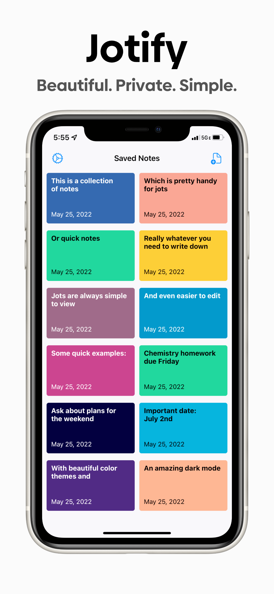
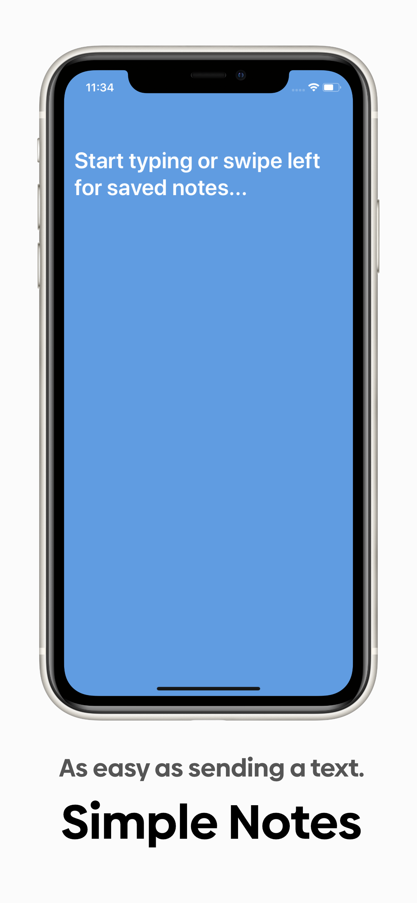
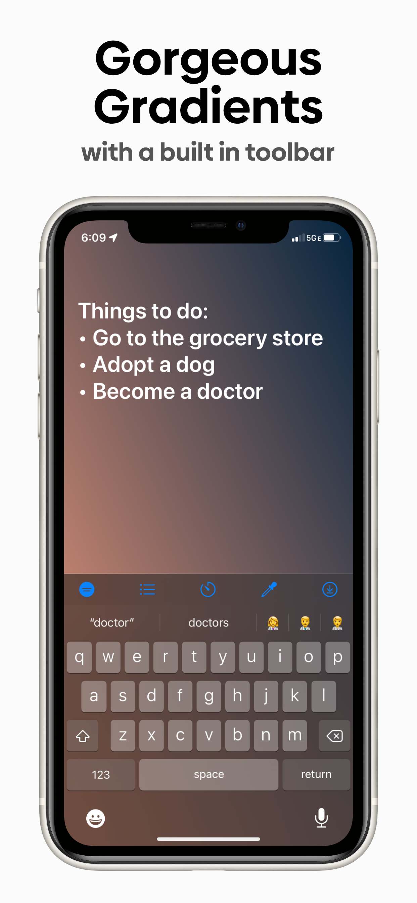
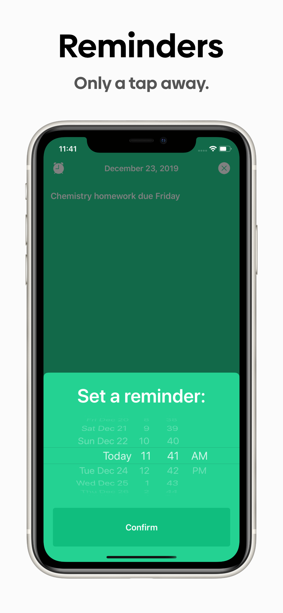

# Jotify | Sticky Notes Reimagined

   

## About

Jotify innovates on traditional sticky notes by empowering the user to write a note with ridiculous speed - faster than sending a text. Secure, simple, and blazing fast, Jotify is the perfect companion for your jots and reminders. There is no app more intuitive or beautiful than Jotify, helping you get back to what's important.

Jotify is written in Swift and utilizes Firebase for its backend. I have always kept Jotify open-source for privacy concerns and the benefit of the community. Jotify loosely follows the MVC architecture, and it also contains an implementation of a widget. See below for a list of dependecies/pods used in the project.

## Testflight

Want to test the lastest features as they come out? Check out Jotify on [Testflight](https://testflight.apple.com/join/EnJVSmNy)!

## App Store

Jotify is available on the [iOS App Store](https://apps.apple.com/us/app/jotify/id1469983730?ls=1) for iPhone and iPad (and unoffically Mac).

## Prerequisites

Jotify is compatible with Xcode 11 and newer and iOS 13 and newer. For those using M1, CocoaPods requires the use of a Rosetta Terminal.

## Dependencies
- [Firebase](https://firebase.google.com) - Used for backend services; includes Analytics, Auth, Firestore, FirestoreSwift, and DynamicLinks
- [Blueprints](https://github.com/zenangst/Blueprints) - Used to create the UICollectionViewLayout in NoteCollectionController.swift
- [Pageboy](https://github.com/uias/Pageboy) - Used for pagination in PageBoyController.swift
- [SwiftMessages](https://github.com/SwiftKickMobile/SwiftMessages) - Used to create an overlay menu in NoteCollectionController.swift
- [ViewAnimator](https://github.com/marcosgriselli/ViewAnimator) - Used to animate the loading of notes in NoteCollectionController.swift
- [SPIndicator](https://github.com/ivanvorobei/SPIndicator) - Used for indicators created by the toolbar in ToolbarViewController.swift
- [PermissionsKit](https://github.com/sparrowcode/PermissionsKit) - Used to prompt user for permissions when creating a reminder in EditingController.swift

## License

This project is licensed under the Apache License 2.0 - see the [LICENSE](LICENSE) file for details
